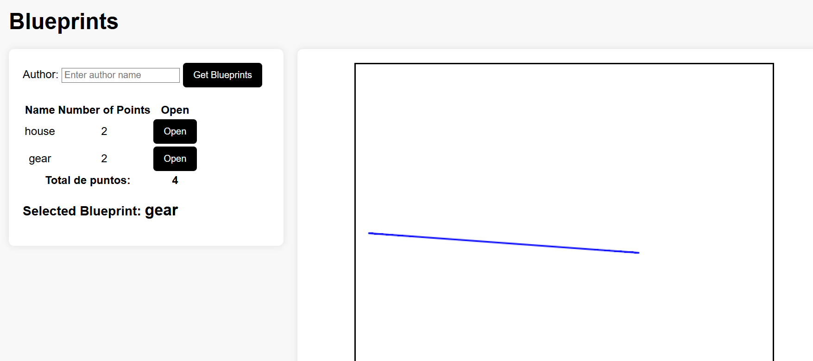
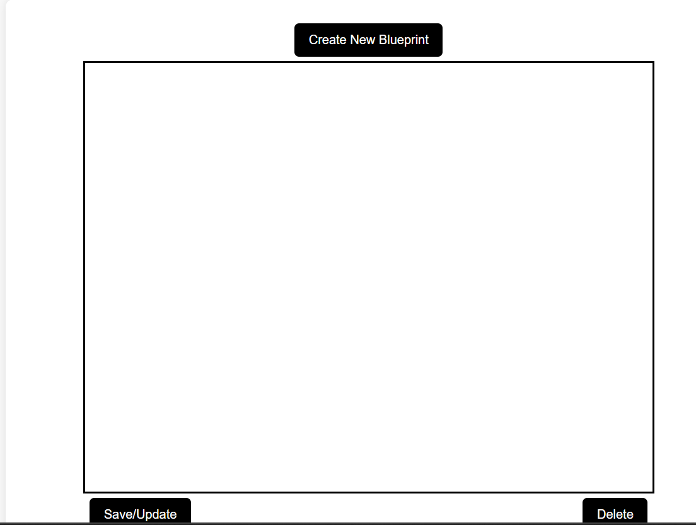

# Lab6
## Integrantes: Juan Cancelado y Diego Chicuazuque

# 🏗️ Blueprints Web Application

## Descripción
Este proyecto es una aplicación web que permite a los usuarios visualizar y gestionar planos (blueprints) mediante una interfaz interactiva. La aplicación utiliza HTML, CSS y JavaScript en el frontend, y un backend basado en Spring Boot que maneja la persistencia de datos.

## Características
- Interfaz para consultar blueprints por autor.
- Tabla con información de blueprints y cantidad de puntos.
- Visualización interactiva de planos en un lienzo (canvas HTML5).
- Alternancia entre una API real y un modo de simulación con datos mock.

## 🛠️ Tecnologías Utilizadas
- **Frontend:** HTML, CSS, Bootstrap, JavaScript (JQuery).
- **Backend:** Java con Spring Boot.
- **Base de datos:** MongoDB (o almacenamiento en memoria para pruebas).

## Instalación y Ejecución
### Requisitos previos
- Tener instalado **Java 11+**.
- Tener instalado **Apache Maven**.

### 🚀 Pasos para ejecutar
1. Clonar el repositorio del proyecto.
2. Navegar al directorio del proyecto y ejecutar:
   ```sh
   mvn spring-boot:run
   ```
3. Acceder a la aplicación desde un navegador en:
   ```sh
   http://localhost:8080
   ```

## 📂 Estructura del Proyecto
```
/
|-- src/
|   |-- main/
|   |   |-- java/com/example/blueprints/  # Código fuente del backend
|   |   |-- resources/
|   |   |   |-- static/
|   |   |   |   |-- js/                    # Archivos JavaScript
|   |   |   |   |-- css/                   # Archivos CSS
|   |   |   |-- templates/                 # Páginas HTML
|-- pom.xml                                # Configuración de Maven
|-- README.md                              # Este archivo
```

## Uso
1. Introducir el nombre de un autor en el campo de entrada y presionar **"Get Blueprints"**.
2. Seleccionar un blueprint de la lista para visualizarlo en el canvas.
3. Alternar entre la API simulada y la real con el botón **"Toggle API"**.



## Cambios que se hicieron

en este lab lo unico que tocaba hacer era agregar botones y unas funcionalidades funcionales con la api

